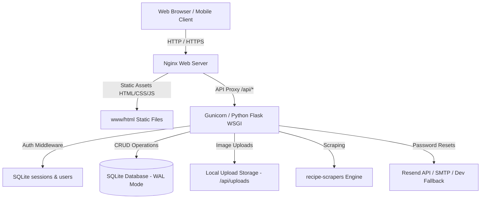
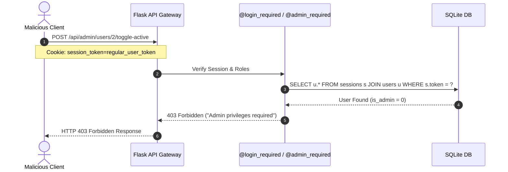
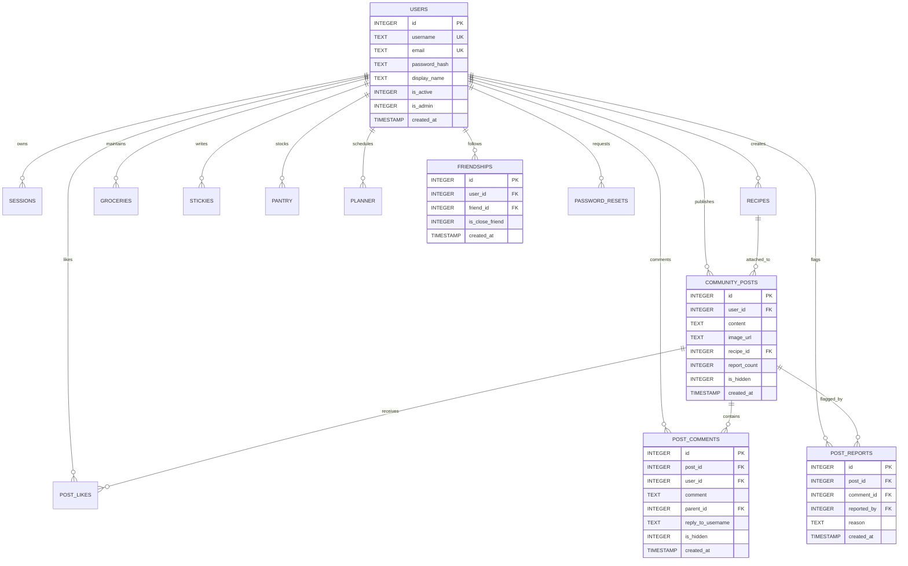

# Virtual Recipe Box & Community Food Feed
## Complete Architecture Specification, Security Model & Operations Manual

---

### Table of Contents
1. [Executive Overview](#1-executive-overview)
2. [Technology Stack & Architectural Topology](#2-technology-stack--architectural-topology)
3. [Zero-Trust Security & Multi-Tenant Isolation](#3-zero-trust-security--multi-tenant-isolation)
4. [Database Schema & Entity Relationship Model](#4-database-schema--entity-relationship-model)
5. [Core Feature Subsystems](#5-core-feature-subsystems)
   - [Authentication & Account Lifecycle](#51-authentication--account-lifecycle)
   - [Recipe Box & 500+ Website Scraper](#52-recipe-box--500-website-scraper)
   - [Recipe Sharing & 1-Click Forking](#53-recipe-sharing--1-click-forking)
   - [Community Food Feed & Photo Uploads](#54-community-food-feed--photo-uploads)
   - [Social Graph & Close Friends VIP System](#55-social-graph--close-friends-vip-system)
   - [Moderation Engine & Admin Dashboard](#56-moderation-engine--admin-dashboard)
   - [Weekly Meal Planner & Smart Grocery Consolidation](#57-weekly-meal-planner--smart-grocery-consolidation)
   - [Pantry Tracker & Sticky Notes](#58-pantry-tracker--sticky-notes)
   - [Backup & Disaster Recovery](#59-backup--disaster-recovery)
6. [Complete REST API Reference](#6-complete-rest-api-reference)
7. [Production Deployment & Operations Guide](#7-production-deployment--operations-guide)
8. [Automated Testing & Load Simulation](#8-automated-testing--load-simulation)

---

### 1. Executive Overview

**Virtual Recipe Box** is a self-hosted, multi-user culinary platform designed for home cooks, bakers, food enthusiasts, and families. It unites private recipe management, weekly meal planning, intelligent ingredient grocery consolidation, and a social food feed into a fast, responsive, and privacy-first web application.

#### Key Design Tenets
- **Data Sovereignty & Privacy**: All recipe data, notes, photos, and social relationships reside on your self-hosted server or private VPS.
- **Zero-Trust Server-Side Enforcement**: Client-side DevTools ("Inspect Element") tampering cannot elevate user privileges, access foreign records, or bypass moderation rules.
- **High Performance & Light Footprint**: Built with lightweight technologies (Python Flask + SQLite WAL Mode + vanilla ES6+ JavaScript) capable of serving hundreds of concurrent virtual chefs at >130 requests/second on low-resource hardware (e.g. Raspberry Pi, cheap VPS).

---

### 2. Technology Stack & Architectural Topology



#### Backend Layer
- **Language & Framework**: Python 3.10+ with Flask REST API.
- **Database**: SQLite 3 with `PRAGMA foreign_keys = ON`, `PRAGMA journal_mode = WAL`, and indexed query optimization.
- **Password Security**: PBKDF2-HMAC-SHA256 with cryptographically randomized salts via Werkzeug security primitives.
- **Session Tokens**: 256-bit cryptographically secure pseudorandom tokens (`secrets.token_urlsafe(32)`) persisted in SQLite and transmitted via `HttpOnly`, `SameSite=Lax` cookies.
- **Image Processing**: Client-side HTML5 Canvas downsampling (max 1280×1280px JPEG) paired with server-side validation and randomized hex filename tokenization.
- **Web Scraping**: Native integration with the `recipe-scrapers` package supporting structured metadata extraction from over 500 culinary websites.

#### Frontend Layer
- **Structure & Styling**: Semantic HTML5, CSS3 Custom Properties (variables) with persistent Light/Dark theme switching, responsive flex/grid layouts.
- **JavaScript**: Modular vanilla ES6+ JavaScript (`auth.js`, `theme.js`) with zero heavy NPM dependencies, ensuring fast cold-start and low battery usage on mobile devices.
- **Media Lightbox**: Pure CSS/JS modal overlay for full-resolution dish photos.

---

### 3. Zero-Trust Security & Multi-Tenant Isolation

A primary security requirement is ensuring that no client manipulation (such as modifying DOM nodes, altering local variables, or forging REST calls) can compromise user accounts, access unauthorized private recipes, or grant admin privileges.



#### Security Mitigations Implemented:
1. **Server-Side Role Verification**:
   - `is_admin` is evaluated on the server directly from the `users` table via `get_authenticated_user()`.
   - The `@admin_required` decorator intercepts calls before endpoint logic executes. If `user.is_admin != 1`, an immediate `403 Forbidden` JSON payload is returned.
2. **Registration Injection Immunity**:
   - In `POST /api/auth/register`, client JSON parameters like `is_admin: 1` are explicitly ignored. Admin roles are assigned only during initial bootstrapping (first registered user) or if the username matches the secure `ADMIN_USERNAMES` environment variable.
3. **IDOR (Insecure Direct Object Reference) Protection**:
   - Every mutation and private read query contains `WHERE user_id = ?` bound to `request.current_user['id']`. Users cannot view or delete another user's recipes, planner, groceries, or stickies by guessing database IDs.
4. **100% Parameterized SQL Queries**:
   - All database calls use SQLite parameter markers (`?`). No user input is concatenated into SQL strings, neutralizing SQL injection vectors.
5. **Rate-Limiting & Brute Force Lockout**:
   - The `login_attempts` table tracks failed logins by IP address. Exceeding 5 failed attempts in 5 minutes triggers a progressive cooldown lockout.
6. **XSS & Content Sanitization**:
   - All dynamic strings rendered in the DOM are passed through HTML entity escaping (`escapeHtml()`) to prevent script injection.
7. **HttpOnly Session Cookies**:
   - Session cookies cannot be read or stolen by third-party client JavaScript (`document.cookie`), preventing session hijacking via XSS.

---

### 4. Database Schema & Entity Relationship Model



---

### 5. Core Feature Subsystems

#### 5.1 Authentication & Account Lifecycle
- **Registration**: Requires valid username (alphanumeric/dot/underscore/hyphen), valid email, and minimum 8-character password. First registered user automatically becomes Administrator.
- **Login & Sessions**: Validates password hash against PBKDF2 salt. Generates a 30-day session token stored in SQLite and set via secure `session_token` cookie.
- **Password Reset Flow**:
  - User submits email/username at `/api/auth/forgot-password`.
  - Secure random token generated (`token_urlsafe(32)`) expiring in 1 hour.
  - Delivery via **Resend API** (`RESEND_API_KEY`), **SMTP** server (`SMTP_HOST`), or logged directly in developer mode.
  - User submits `/api/auth/reset-password`, updating the password hash and invalidating all prior active sessions.
- **Account Settings**: Users can change display name and password from the header dropdown modal.

#### 5.2 Recipe Box & 500+ Website Scraper
- **Recipe Management**: Store title, category, ingredients, step-by-step instructions, prep time, cook time, difficulty (Easy/Medium/Hard), servings, and visibility (`public`, `close_friends`, `private`).
- **URL Importer**: Paste any cooking recipe link (e.g. AllRecipes, NYT Cooking, Food Network, BBC Good Food, Serious Eats) to automatically scrape titles, ingredients, cook times, and instructions via the embedded scraper engine.

#### 5.3 Recipe Sharing & 1-Click Forking
- **Share Tokens**: Clicking "Share Recipe" assigns a cryptographic 16-byte token (`share.html?token=xyz`).
- **1-Click Clone**: When any user (or friend) views a shared recipe or sees it attached to a community post, clicking **"📥 Save to My Box"** performs a deep copy into their own personal Recipe Box with their own ownership and customizable copy.

#### 5.4 Community Food Feed & Photo Uploads
- **Stream Filtering**:
  - `🌟 All Community`: Global public feed ordered chronologically.
  - `👤 My Posts`: Personal timeline of posts published by the logged-in user with summary statistics (likes received, comments received, friend counts).
  - `👥 Friends Only`: Posts published by users you follow.
  - `⭐ Close Friends`: Posts from users marked with Close Friend status.
  - `🔥 Trending`: Algorithmic ranking calculated as `(Likes * 2) + Comments` in the last period.
- **Photo Upload Engine**:
  - Supports mobile camera capture, drag-and-drop, and file pickers (`PNG`, `JPG`, `WEBP`, `HEIC`).
  - Client-side Canvas automatically scales images down to max 1280px to save network bandwidth and storage.
  - Saved to `/api/uploads/img_<hex>.jpg` with direct serving and image lightbox zoom.
- **Threaded Nested Comments**:
  - Supports hierarchical replies (`parent_id`) with `@username` reply attribution.

#### 5.5 Social Graph & Close Friends VIP System
- **Following System**: Follow any cook on the platform with 1 click.
- **⭐ Close Friends Tier**:
  - Mark specific friends as Close Friends.
  - Allows friends to view your Close Friends-only recipes in the dedicated **Friend's Recipe Box Modal**.
  - Highlights their posts with glowing gold badges across the community feed.

#### 5.6 Moderation Engine & Admin Dashboard
- **Community Flagging**: Any logged-in user can report posts or comments with reasons (`spam_link`, `harassment`, `inappropriate`, `misleading`).
- **Auto-Quarantine (3-Strike Rule)**: Content receiving 3 or more unique reports is automatically quarantined (`is_hidden = 1`) and hidden from the public feed pending admin review.
- **Administrator Moderation Dashboard**:
  - Accessible via the `🛡️ Mod Queue` tab or user dropdown menu.
  - Displays pending reports, reporter usernames, timestamps, and reason tags.
  - **1-Click Dismiss**: Clears false reports and restores post/comment visibility to the feed.
  - **1-Click Mod Delete**: Permanently removes spam posts or comments.
  - **User Suspension**: 1-click toggle to suspend abusive accounts, instantly revoking all active sessions.

#### 5.7 Weekly Meal Planner & Smart Grocery Consolidation
- **Meal Planning**: Plan Breakfast, Lunch, Dinner, Tasks, and Prep Notes for any day of the year.
- **Smart Ingredient Consolidation**:
  - Automatically merges duplicate items across recipes.
  - Example: `1 cup whole milk` + `2 cups whole milk` + `1/2 cup whole milk` consolidates intelligently into `3.5 cups whole milk`.
  - Supports unit conversions (cups, tbsp, tsp, lbs, oz, grams, cloves, cans, etc.).

#### 5.8 Pantry Tracker & Sticky Notes
- **Pantry Inventory**: Track on-hand ingredients by category (Produce, Dairy, Spices, Meat, Dry Goods).
- **Sticky Notes**: Digital scratchpad on the home dashboard for quick kitchen reminders and grocery ideas.

#### 5.9 Backup & Disaster Recovery
- **JSON Export (`GET /api/backup`)**: Full database snapshot including recipes, planner calendar, groceries, pantry, and sticky notes.
- **JSON Restore (`POST /api/restore`)**:
  - `Merge Mode`: Non-destructively imports items, skipping existing duplicates.
  - `Replace Mode`: Flushes existing tables for the authenticated user and replaces with the backup archive.

---

### 6. Complete REST API Reference

| Method | Endpoint | Auth Level | Description |
| :--- | :--- | :--- | :--- |
| `POST` | `/api/auth/register` | Public | Register new user (`username`, `email`, `password`, `display_name`) |
| `POST` | `/api/auth/login` | Public | Authenticate user & set session cookie |
| `POST` | `/api/auth/logout` | Public | Revoke session & clear cookie |
| `GET` | `/api/auth/me` | Authenticated | Fetch authenticated user profile and roles |
| `PUT` | `/api/auth/profile` | Authenticated | Update display name or change password |
| `POST` | `/api/auth/forgot-password` | Public | Request password reset email / token |
| `POST` | `/api/auth/reset-password` | Public | Apply new password using reset token |
| `POST` | `/api/upload/image` | Authenticated | Upload photo (multipart form or base64) |
| `GET` | `/api/uploads/<filename>` | Public | Serve uploaded image file |
| `GET` | `/api/recipes` | Authenticated | List all recipes owned by current user |
| `POST` | `/api/recipes` | Authenticated | Create new recipe |
| `GET` | `/api/recipes/<id>` | Authenticated | Get single recipe by ID |
| `PUT` | `/api/recipes/<id>` | Authenticated | Update recipe details |
| `DELETE` | `/api/recipes/<id>` | Authenticated | Delete recipe |
| `POST` | `/api/recipes/<id>/toggle-favorite` | Authenticated | Toggle favorite status |
| `POST` | `/api/recipes/<id>/share` | Authenticated | Generate / retrieve public share token |
| `GET` | `/api/public/recipes/<share_token>` | Public | View shared recipe details |
| `POST` | `/api/recipes/clone/<share_token>` | Authenticated | 1-Click clone recipe into personal box |
| `POST` | `/api/recipes/import-url` | Authenticated | Scrape structured recipe from website URL |
| `GET` | `/api/community/posts` | Public/Auth | Fetch food feed (`filter=all\|my_posts\|friends\|close_friends\|trending`) |
| `POST` | `/api/community/posts` | Authenticated | Create community post with optional image and recipe |
| `DELETE` | `/api/community/posts/<id>` | Author / Admin | Delete post (Admins can delete any post) |
| `POST` | `/api/community/posts/<id>/like` | Authenticated | Toggle like on a post |
| `GET` | `/api/community/posts/<id>/comments` | Public | Get threaded comments for a post |
| `POST` | `/api/community/posts/<id>/comments` | Authenticated | Post top-level comment or threaded reply |
| `DELETE` | `/api/community/comments/<id>` | Author / Admin | Delete comment (Admins can delete any comment) |
| `POST` | `/api/community/posts/<id>/report` | Authenticated | Report post (quarantines at 3 reports) |
| `POST` | `/api/community/comments/<id>/report` | Authenticated | Report comment (quarantines at 3 reports) |
| `GET` | `/api/friends` | Authenticated | List followed friends and close friend status |
| `POST` | `/api/friends/<friend_id>` | Authenticated | Follow a user |
| `DELETE` | `/api/friends/<friend_id>` | Authenticated | Unfollow a user |
| `POST` | `/api/friends/<friend_id>/toggle-close-friend` | Authenticated | Toggle Close Friend VIP status |
| `GET` | `/api/users/<user_id>/recipes` | Public/Auth | Get friend's Recipe Box based on visibility access |
| `GET` | `/api/users/me/stats` | Authenticated | Get user activity metrics (posts, likes, recipes) |
| `GET` | `/api/admin/moderation/queue` | **Admin Only** | Fetch all flagged/quarantined posts & comments |
| `POST` | `/api/admin/moderation/posts/<id>/dismiss` | **Admin Only** | Dismiss post reports & restore visibility |
| `POST` | `/api/admin/moderation/comments/<id>/dismiss` | **Admin Only** | Dismiss comment reports & restore visibility |
| `POST` | `/api/admin/users/<id>/toggle-active` | **Admin Only** | Suspend / activate a user account |
| `POST` | `/api/admin/users/<id>/toggle-admin` | **Admin Only** | Promote / demote user admin status |
| `GET` | `/api/planner` | Authenticated | Fetch full weekly meal planner calendar |
| `POST` | `/api/planner/<date_key>` | Authenticated | Save planner day (meals, tasks, notes) |
| `DELETE` | `/api/planner/<date_key>` | Authenticated | Clear planner day |
| `GET` | `/api/groceries` | Authenticated | List all grocery items |
| `POST` | `/api/groceries` | Authenticated | Add grocery items (with auto-consolidation) |
| `POST` | `/api/groceries/consolidate` | Authenticated | Consolidate unchecked grocery items |
| `POST` | `/api/groceries/<id>/toggle` | Authenticated | Toggle checked status |
| `DELETE` | `/api/groceries/<id>` | Authenticated | Delete grocery item |
| `POST` | `/api/groceries/clear-checked` | Authenticated | Clear all checked grocery items |
| `GET` | `/api/pantry` | Authenticated | List pantry inventory |
| `POST` | `/api/pantry` | Authenticated | Add items to pantry |
| `DELETE` | `/api/pantry/<id>` | Authenticated | Delete item from pantry |
| `POST` | `/api/pantry/clear` | Authenticated | Clear pantry inventory |
| `GET` | `/api/stickies` | Authenticated | List sticky notes |
| `POST` | `/api/stickies` | Authenticated | Add sticky note |
| `DELETE` | `/api/stickies/<id>` | Authenticated | Delete sticky note |
| `GET` | `/api/backup` | Authenticated | Export full account JSON backup |
| `POST` | `/api/restore` | Authenticated | Restore account from JSON (`merge` or `replace`) |

---

### 7. Production Deployment & Operations Guide

#### 7.1 Environment Variables
Configure these in your production `.env` or systemd service file:

```ini
# Flask Secret Key for session signing
SECRET_KEY=generate_a_strong_64_char_random_secret_here

# SQLite Database Location
DATABASE_PATH=/var/lib/recipes/recipes.db

# Media Upload Directory
UPLOAD_FOLDER=/var/lib/recipes/uploads

# Bootstrapped Admin Usernames (comma-separated)
ADMIN_USERNAMES=sawyer,michaela,admin,sawman2224

# Email Delivery Configuration (Choose Resend or SMTP)
RESEND_API_KEY=re_123456789abcdef
RESEND_FROM=recipes@yourdomain.com

# SMTP Configuration (if Resend is not used)
SMTP_HOST=smtp.mailgun.org
SMTP_PORT=587
SMTP_USER=postmaster@yourdomain.com
SMTP_PASS=your_smtp_password
SMTP_TLS=true
EMAIL_FROM=recipes@yourdomain.com
```

#### 7.2 Running with Gunicorn & Nginx

1. **Install Dependencies**:
   ```bash
   python3 -m venv venv
   source venv/bin/activate
   pip install -r requirements.txt
   ```

2. **Systemd Service (`/etc/systemd/system/recipe-api.service`)**:
   ```ini
   [Unit]
   Description=Virtual Recipe Box API
   After=network.target

   [Service]
   User=www-data
   WorkingDirectory=/var/www/recipe-box/recipe_api
   EnvironmentFile=/var/www/recipe-box/.env
   ExecStart=/var/www/recipe-box/venv/bin/gunicorn -w 4 -b 127.0.0.1:5000 app:app
   Restart=always

   [Install]
   WantedBy=multi-user.target
   ```

3. **Nginx Reverse Proxy Configuration (`/etc/nginx/sites-available/recipe-box`)**:
   ```nginx
   server {
       listen 80;
       server_name recipes.yourdomain.com;

       root /var/www/recipe-box/www/html;
       index index.html;

       location / {
           try_files $uri $uri/ =404;
       }

       location /api/ {
           proxy_pass http://127.0.0.1:5000;
           proxy_set_header Host $host;
           proxy_set_header X-Real-IP $remote_addr;
           proxy_set_header X-Forwarded-For $proxy_add_x_forwarded_for;
           proxy_set_header X-Forwarded-Proto $scheme;
           client_max_body_size 16M;
       }
   }
   ```

---

### 8. Automated Testing & Load Simulation

#### 8.1 Running the Full Unit & Integration Test Suite
The repository includes a comprehensive automated test suite (`test_suite.py`) covering all authentication, isolation, sharing, commenting, reporting, and admin moderation features:

```bash
python3 test_suite.py
```
*Expected Output*:
```text
Ran 10 tests in 1.88s
OK
```

#### 8.2 Running the 500-User Intensive Concurrent Load Test
Simulate hundreds of parallel virtual chefs performing simultaneous registrations, recipe scrapings, photo uploads, likes, threaded comments, cloning, and meal planning:

```bash
python3 test_feed.py --url http://127.0.0.1:5000 --users 500
```
*Performance Benchmark*:
- **Concurrency**: 50 worker threads
- **Throughput**: >130 requests/second
- **Success Rate**: 100.0% with zero database lock collisions under SQLite WAL mode.
